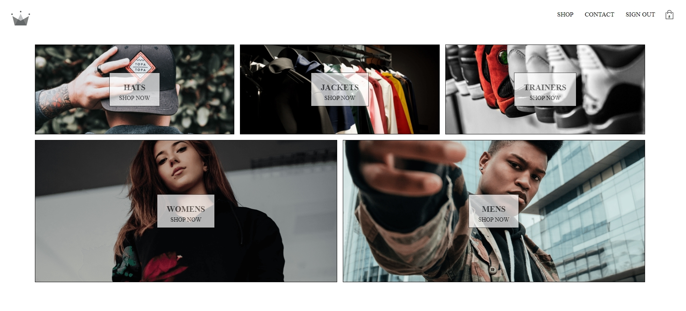

## Getting Started

Once cloned or downloaded, use npm install command in the terminal at root level and then npm run dev. You should then be able to view the application in the browser at http://localhost:3000/ or you can view it running at this link https://salty-temple-21381.herokuapp.com/

## Brief

Re-factor of clothing store to use redux sagas.

Create clothing store with basket to add and remove items as well as taking payments.

Using React, Redux, redux-saga for asynchronous actions, Firebase for authentication and storing shop data, Memoization for performance, stripe for payments, made components styled components and have added an animated loading spinner when the collection and collection preview pages load. Spinner can mostly be seen when refreshing collection or collection preview pages. Added server to let stripe payments complete.

# Project Title

Clothing store

## Running the tests

In the terminal run npm test

## Built With

JavaScript, React, Redux, redux-saga, styled components, Firebase, Node, Express, Stripe 
